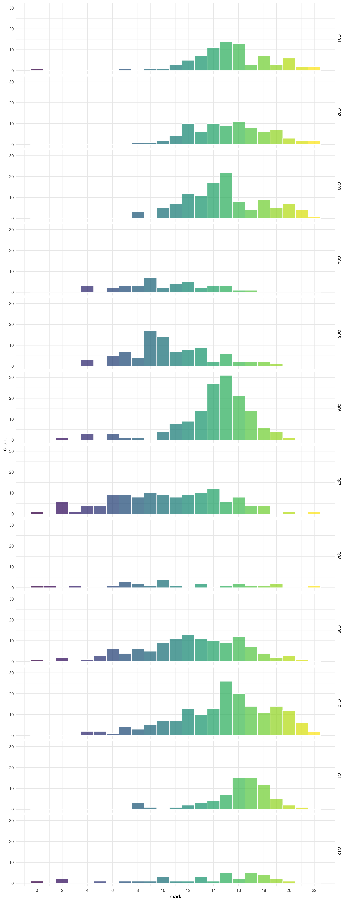
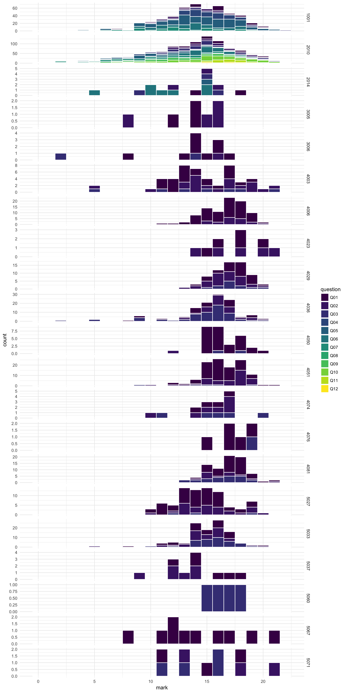

We are also using R to generate exam and assessment feedback and reports using [`markr`](https://github.com/debruine/markr). The code for this is quite specific to our department right now, but Lisa will work to make it more generic and available to other groups soon.

```{r, eval = F}
# install markr
devtools::install_github("debruine/markr")

# load the marks and feedback from all files in the marking directory
marks <- load_marks(
  "marking/directory", # file or directory with marking spreadsheets
  evalfile = "l1_eval.csv", # optional file for making feedback tables
  moodlefile = "Moodle_id_exam_feedback.csv", # optionally match to moodle ID from moodle.xlsx file
  dir = "feedback/level1/" # directory to save feedback files in
)

# make a report summarising the overal marking distribution (mark_dist)
# and the distribution for each eval category (cat_dist)
make_report(
  marks,
  show = c("mark_dist", "cat_dist")
) 

# render feedback files from the template for each student
make_feedback(
  marks, 
  template = "L1_template.Rmd",
  filename = "L1_feedback.pdf",
  moodle_dir = TRUE # save files with the wierd Moodle directory structure
)

```


## Example Marking Spreadsheet


## Example Feedback

<embed src="files/example_feedback.pdf" width="100%" height="1200px" />
[Download example_feedback.pdf](files/example_feedback.pdf)

## Example Assessment Report

<embed src="files/example_report.pdf" width="100%" height="1200px" />
[Download example_report.pdf](files/example_report.pdf)

## Example Exam Visualisations

You can visualise the distribution of marks across different questions in an exam.



Or across all classes.




